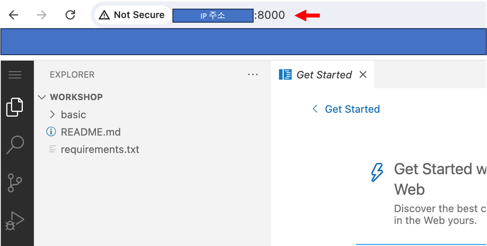

# VsCode on EC2 with Amazon Linux 2023 & Python 3.9

이 CloudFormation 템플릿은 Amazon Linux 2023과 Python 3.9이 설치된 EC2 인스턴스를 설정합니다.
이 인스턴스는 사전에 VS Code 서버와 지정된 Git 저장소를 클론하도록 구성되어 있습니다.

## 파라미터

- `Region`: 리소스가 배포될 AWS 리전. 기본값은 `us-west-2`.
- `VpcCidrBlock`: VPC의 CIDR 블록. 기본값은 172.30.0.0/16.
- `PublicSubnetCidrBlock` : 퍼블릭 서브넷의 CIDR 블록. 기본값은 172.30.1.0/24.
- `InstanceType`: EC2 인스턴스 유형. 기본값은 `t3.xlarge`.
- `AMIType`: EC2 인스턴스를 위한 Amazon Linux 버전. 기본값은 `AmazonLinux2023`.
- `AmazonLinux2023AmiId`: Amazon Linux 2023 AMI ID.
- `GitRepositoryUrl`: 클론할 Git 저장소의 URL.

## 리소스

### VPC

지정된 CIDR 블록을 가진 VPC를 생성합니다.

### 인터넷 게이트웨이

인터넷 게이트웨이를 생성하고 VPC에 연결합니다.

### 서브넷

VPC 내에 퍼블릭 서브넷을 생성합니다.

### 라우트 테이블

라우트 테이블을 생성하고 퍼블릭 서브넷에 연결하여 인터넷 액세스를 가능하게 합니다.

### 보안 그룹

HTTP, 8000, 8080 포트 액세스를 허용하는 보안 그룹을 생성합니다.
여기서 8000 포트는 해당 VSCode on EC2 를 접속하는 포트이며
8080 포트는 streamlit 데모 실행시 적용하는 포트를 의미합니다.
(즉, streamlit 실행시 8080 포트로 실행 필수, 일반적으로 Streamlit 은 8080포트 사용)

### IAM Role

EC2 인스턴스를 위한 IAM 역할 및 인스턴스 프로파일을 생성합니다.

### EC2 인스턴스

Amazon Linux 2023을 사용하여 EC2 인스턴스를 생성하고, Python 3.9, VS Code 서버를 설치하며, 지정된 Git 저장소를 클론합니다.
또한 git repository 의 requirements.txt 에 있는 패키지를 설치하고, vscode 코드 실행시 해당 repository 기준으로 실행됩니다.

## 출력

- `EC2InstancePublicIP`: VS Code 서버 EC2 인스턴스의 공용 IP 주소.

## AWS Console 에서 실행

### 1. AWS Management Console에 로그인

서비스 메뉴에서 "CloudFormation"을 선택합니다.

### 2. 스택 생성 시작

CloudFormation 콘솔에서 "스택 생성(Create Stack)" 버튼을 클릭한다.

### 3. 템플릿 지정

"기존 템플릿 사용 (Choose an existing template)"을 선택하고 "템플릿 파일 업로드(Upload a template file)"을 선택하고, 해당 CloudFormation 템플릿 파일(ec2vscode_python.yaml)을 업로드합니다.
그런 다음 "다음(Next)" 버튼을 클릭합니다.

### 4. 스택 세부 정보 입력

스택 이름(Stack name)과 파라미터(Parameter) 값을 입력합니다. 파라미터 값은 기본값을 그대로 사용하거나 필요에 따라 수정합니다.

### 5. 구성 옵션 설정

"구성 옵션 구성(Configure stack options)" 단계에서는 태그(Tag), 권한(Permission), 고급 옵션(Advanced options) 등을 설정할 수 있습니다. 이 단계에서는 기본값을 사용하고 "다음(Next)" 버튼을 클릭합니다.

### 6. 검토 및 생성

모든 설정을 검토한 후 "스택 생성(Create stack)" 버튼을 클릭하여 스택 생성을 시작합니다. IAM 설정이 포함되므로, IAM resources 허용 권한을 체크합니다.

### 7. 스택 생성 완료 확인

스택 생성이 완료될 때까지 기다립니다. 생성 상태가 "CREATE_COMPLETE"가 되면, 리소스가 성공적으로 배포된 것입니다.

### 8. 출력 확인

CloudFormation 콘솔의 스택 상세 정보에서 "출력(Outputs)" 탭을 확인하여 EC2 인스턴스의 공용 IP 주소를 확인합니다. 이 IP 주소를 사용하여 VS Code 서버에 접속할 수 있습니다.

### 9. vscode on server 접속

출력에서 확인한 Ip 주소를 바탕으로 "http://Ip주소:8000" 로 vscode 에 접속합니다. EC2 구동으로 인해 초기 몇분은 접속이 안될수 있습니다.

이제 모든 단계가 완료되었습니다.
필요에 따라 추가 설정을 하거나 VS Code 서버에 접속하여 작업을 시작할 수 있습니다.
